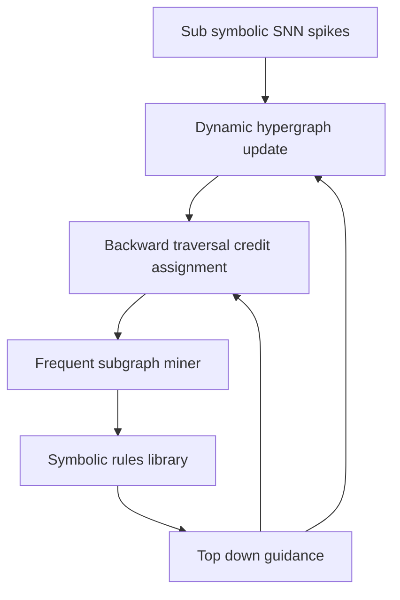
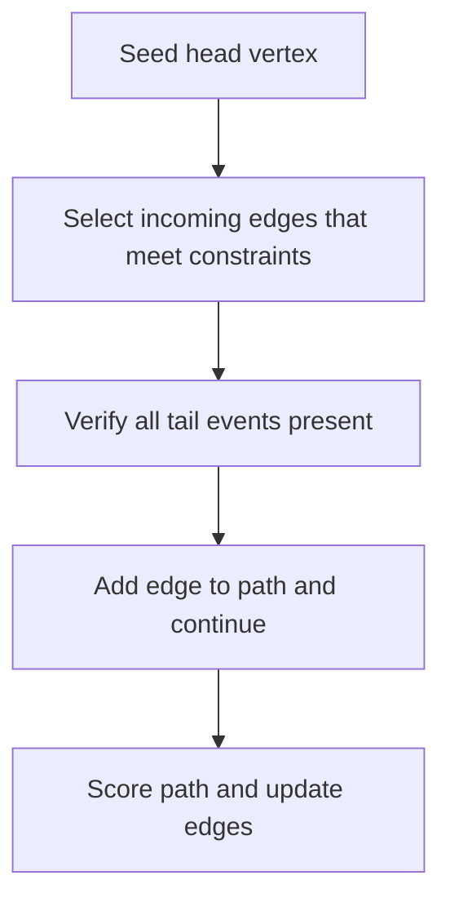
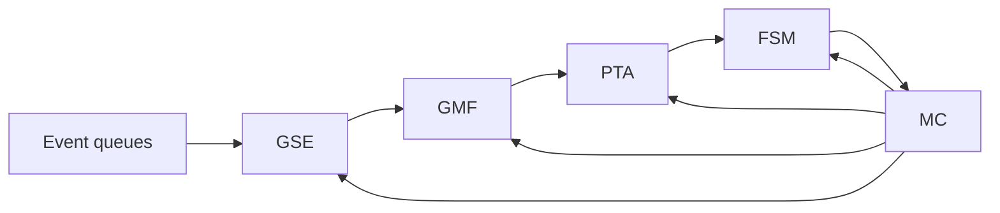

# Dynamic Causal Hypergraph DCH Technical Specification and Causa Chip Hardware Overview

Version v0.1 tech spec outline and acceptance criteria

Scope Full technical specification for researchers covering DCH formalism, DHG construction with TC kNN, hyperedge plasticity, constrained backward hyperpath traversal with B walk adaptation, streaming frequent hyperpath mining, and meta controller policy, with complexity analysis, data structures, clear interfaces, and 3 to 4 Mermaid diagrams; plus 4 to 6 page hardware co design overview for Causa Chip; target use cases DVS Gesture and N MNIST; Python prototype plan using PyTorch Norse.

Table of contents
- 1. Formal foundations and glossary
- 2. Dynamic Hypergraph Construction DHG with TC kNN
- 3. Hyperedge plasticity refine and prune
- 4. Hyperpath embedding and causal context similarity
- 5. Credit assignment via constrained backward hyperpath traversal
- 6. Streaming frequent hyperpath mining and online rule induction
- 7. Hierarchical abstraction and higher order hyperedges
- 8. Task aware scaffolding isolate or reuse and freeze
- 9. Module interfaces and data contracts
- 10. Complexity and resource model
- 11. Software prototype blueprint Python Norse
- 12. Evaluation protocol datasets metrics and ablations
- 13. Parameter defaults and tuning
- 14. Risk analysis and mitigations
- 15. Causa Chip hardware co design overview
- 16. Mermaid diagrams
- 17. References
- 18. Acceptance criteria checklist

## 1. Formal foundations and glossary

Symbols and entities
- V t set of vertices spike events v equals neuron id comma timestamp
- E t set of directed hyperedges e equals Tail to Head with Head size equals 1
- Attributes per vertex neuron id int, timestamp float microseconds
- Attributes per hyperedge tail set of vertex ids, head vertex id, delay window min max, refractory, reliability score in 0 to 1, creation time, last update time, usage count
- Reliability score central learnable confidence updated by evidence based rules

Temporal semantics
- V t contains all events with timestamp less than or equal to t
- E t evolves online via GROW PRUNE and abstraction operations
- Valid hyperedge requires all tail timestamps in window before head timestamp and respects refractory for head neuron

Causal path objects
- Hyperpath is a DAG where each traversed hyperedge has all tail vertices present earlier on the path
- Path score is product or min of reliability scores of edges

## 2. Dynamic Hypergraph Construction DHG with TC kNN

Purpose Generate candidate causal hypotheses when a postsynaptic spike occurs

Algorithm TC kNN for event v post at neuron n j time t j
- Identify presynaptic sources S j from static synapse map
- For each i in S j find most recent spike v i within window t j minus delay max to t j minus delay min
- Build candidate sets
  - Unary edges per qualifying v i
  - K way edges for small k up to k max for presyn spikes within micro window delta causal
- Initialize reliability score small epsilon and insert into E t

Data structures
- Per neuron ring buffer of recent events with binary search by time
- Adjacency maps keyed by head vertex id to list of incoming hyperedges
- Hash of tail signature to hyperedge id for deduplication

Complexity and constraints
- Time O degree in plus log buffer for searches plus combinations up to k max
- Memory proportional to active hyperedges bounded by pruning policy
- Parameters delay min delay max k max delta causal epsilon init

## 3. Hyperedge plasticity refine and prune

Refinement predict and confirm
- Potentiate increase reliability when tail observed and head arrives within window
- Depress decrease reliability when tail observed and head absent in window
- Optional time decay toward prior

Update rule example
- reliability new equals clamp reliability old plus alpha times outcome minus reliability old
- outcome equals 1 for confirmed else 0
- Use per edge learning rate alpha and confidence floor and ceiling

Pruning
- Remove edge when reliability below tau prune or age exceeds tau age with low usage
- Maintain budget cap on hyperedges per neuron pair and global cap

Concurrency
- Event driven updates use atomic add on reliability and counters
- Deterministic order per head neuron by timestamp
- Idempotent updates via edge observation tokens

## 4. Hyperpath embedding and causal context similarity

Goal Group vertices by similarity of causal histories not by raw features

Design
- For each vertex compute an embedding of the backward k radius hyperpath
- Use Weisfeiler Lehman style hashing over multiset of labeled tails and delays
- Maintain incremental updates as new edges arrive
- Use embeddings to propose higher order hyperedges between groups of vertices with similar origins

Parameters
- Radius r levels, hash base, embedding dimension d, update period

## 5. Credit assignment via constrained backward hyperpath traversal

Objective Assign credit or blame to edges using evidence from valid causal hyperpaths

Traversal policy Multi start random B walk
- Seed at supervised or reward tagged head vertices
- Step from head to candidate incoming hyperedges that satisfy B connectivity all tails present and temporal constraints
- Sample edges proportional to reliability bias and optionally rule priors
- Stop when reaching input sources or budget exceeded
- Score each discovered path by product or min of edge reliabilities
- Aggregate scores per edge for potentiation or depression

Temporal logic constraints
- Enforce delay windows and refractory for head neurons
- Prevent two edges with same head neuron too close in time

Parameters
- Seeds per event M, max steps L, branching cap B, temperature tau select, positive or negative update weights

## 6. Streaming frequent hyperpath mining and online rule induction

Pipeline
- Canonical labeling convert each high score hyperpath to a unique template id
- Counting maintain frequency with sliding window and decay
- Thresholding promote templates that exceed support and reliability thresholds
- Rule abstraction emit a symbolic rule and register a higher order hyperedge candidate

Data structures
- On line hash tables for template counts, approximate counters, reservoirs

Parameters
- Support s min, reliability r min, window W, decay gamma

## 7. Hierarchical abstraction and higher order hyperedges

Procedure
- When a template passes thresholds create a new hyperedge with tail equal to source vertices of the hyperpath and head equal to sink vertex
- Set initial reliability from aggregate path statistics
- Add provenance link to underlying edges for audit

Integrity constraints
- Detect and prevent cycles
- Deduplicate similar rules via canonicalization
- Limit fan in per abstraction

## 8. Task aware scaffolding isolate or reuse and freeze

Task similarity detection
- Present new task samples and measure activation overlap of high reliability edges and paths
- Compute similarity score by Jaccard or cosine over activated edge ids or embeddings

Policy
- If similarity below threshold freeze critical edges for previous tasks and bias GROW to new region id
- If similarity above threshold keep relevant edges plastic and raise learning rates locally
- Maintain per task registry of protected edges and budgets

## 9. Module interfaces and data contracts

Event ingestion
- push event neuron id int, timestamp float, meta dict

DHG constructor
- on post spike neuron id, timestamp returns list of edge ids created
- query edges by head vertex id or by tail signature

Plasticity
- update edge id, event outcome confirmed or missed, time
- prune policy step returns removed edge ids

Traversal
- assign credit seeds list of vertex ids, mode reward or error, returns edge delta map

FSM
- submit path path object with edge list and score
- poll rules returns list of new rule descriptors

Meta controller
- step stats snapshot returns control actions like adjust pruning threshold or traversal temperature

Logging and metrics
- emit counters for events per second, edges active, average reliability, prune rate, traversal yield, rules discovered

## 10. Complexity and resource model

Event vision targets
- DVS Gesture average events per second ten to the five to ten to the six
- N MNIST average events per second ten to the four to ten to the five

Targets
- End to end throughput events per second greater than or equal to dataset rate with headroom factor two
- Memory budget edges below fifty million for desktop prototype and below five million for embedded

Asymptotics
- DHG O degree in plus combinations up to k max per post spike
- Traversal near linear in explored edges with caps M, L, B
- FSM near linear in submitted paths with hash update O one

## 11. Software prototype blueprint Python Norse

Stack
- Python 3.11, PyTorch, Norse, tonic for event datasets, networkx for audit, numpy, numba optional

Repository structure
- dch core library with modules events, dhg, plasticity, traversal, fsm, rules, meta
- experiments with dvs gesture and n mnist
- tests with unit and integration
- docs with spec and diagrams

Data flow
- Load event stream, feed to SNN for spikes or use recorded spikes
- For each post spike run DHG then plasticity updates
- Periodically run traversal on supervision or reward seeds
- Stream high score paths to FSM and apply abstraction and policy

Test harness
- Deterministic seed, synthetic micrographs, invariant checks for temporal logic constraints

## 12. Evaluation protocol datasets metrics and ablations

Datasets
- DVS Gesture, N MNIST as event vision benchmarks

Baselines
- Surrogate gradient SNN on same datasets, reservoir SNN, TEH static variant without DHG

Metrics
- Classification accuracy, F one for event detection, sample efficiency, energy proxy events per update, interpretability audit success rate, rule stability

Ablations
- Remove FSM, remove hierarchical abstraction, vary k max and traversal caps, disable task scaffolding

## 13. Parameter defaults and tuning

Suggested defaults
- delay min one ms, delay max thirty ms, k max three, delta causal two ms
- epsilon init 0.05, alpha 0.1, tau prune 0.02, tau age 10 seconds of inactivity
- traversal M 8, L 12, B 4, tau select 0.7
- FSM s min 50, r min 0.6, W 60 seconds, gamma 0.98
- scaffolding similarity threshold 0.35

Tuning strategy
- Grid search small around defaults, adaptive meta controller adjusts thresholds online

## 14. Risk analysis and mitigations

Risks
- Combinatorial explosion of candidate edges and paths
- Noise and spurious correlations
- Catastrophic forgetting
- Irregular memory access overhead

Mitigations
- Strict caps, reliability based pruning, hierarchical abstraction to compress
- Temporal logic constraints and refractory enforcement
- Task aware freeze and region partitioning
- Cache conscious data layouts and batch updates

## 15. Causa Chip hardware co design overview

Units
- Graph Streaming Engine handles TC kNN and event queues
- Graph Memory Fabric near memory processing with ReRAM like arrays and atomic updates
- Parallel Traversal Accelerator PE array for constrained walks and SpMV SpGEMM on incidence structures
- Frequent Subgraph Miner pipeline for canonical labeling and counting
- Meta Controller RISC V class core with policy

Dataflow
- Events to GSE to GMF insert edges then PTA traverses and emits paths to FSM then rules to MC which feeds back controls to GSE GMF PTA FSM

Resource targets desktop prototype
- Bandwidth requirement greater than 50 GB per second across graph fabric
- On chip memory scratch greater than 256 MB, off chip DRAM
- Latency budget per event less than 100 microseconds for DHG path

Open questions
- Feasible PIM primitives for atomic reliability update
- Canonical labeling hardware throughput per path
- Partitioning hypergraph across PEs to minimize NoC contention

## 16. Mermaid diagrams

Neuro symbolic learning loop

DHG construction around a post spike

Constrained backward traversal

Causa Chip dataflow

## 17. References

- Cite prior work on DHGNN, temporal logic for events, ILP, frequent subgraph mining for dynamic graphs, SNN libraries Norse and BindsNET, event vision datasets

## 18. Acceptance criteria checklist

Functional completeness
- Formal definitions V t E t hyperedge validity and reliability with temporal semantics are specified
- DHG TC kNN algorithm with data structures parameters and complexity is specified
- Plasticity rules with update equations decay and pruning are specified
- Traversal algorithm with B connectivity and temporal constraints and scoring is specified
- Streaming FSM with canonical labeling counting thresholds and outputs is specified
- Hierarchical abstraction creation constraints and provenance are specified
- Task aware scaffolding similarity policy freeze and reuse are specified
- Module interfaces and data contracts are listed with input output types and responsibilities

Engineering readiness
- Complexity and resource model with numeric targets for DVS Gesture and N MNIST is provided
- Software prototype blueprint with repo layout data flow test harness and dependencies is provided
- Parameter defaults and tuning guidance are provided
- Risk and mitigation plan is provided

Hardware overview
- Causa Chip units and dataflow are specified with resource targets and open questions

Documentation quality
- Three or more Mermaid diagrams render and match the workflows
- Glossary and symbol list are included
- References include core related work

Validation plan
- Evaluation protocol with datasets baselines metrics ablations is defined
- Success criteria include accuracy and interpretability and throughput thresholds