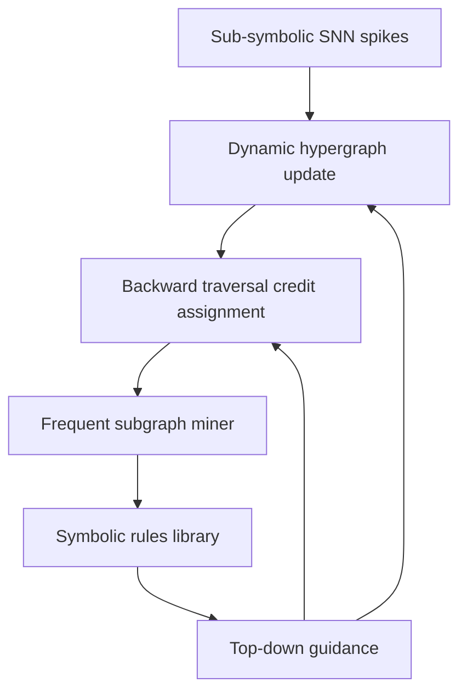

# Dynamic Causal Hypergraph DCH — Technical Specification v0.1 and Causa-Chip Co-Design

Version v0.1  
Date 2025-10-04

Executive abstract  
This v0.1 technical specification defines the Dynamic Causal Hypergraph DCH framework and a hardware co-design, Causa-Chip, for real-time event-driven learning. The DCH turns spiking computation into an evolving, causal, neuro-symbolic model with explicit hyperedges as testable hypotheses, evidence-based credit assignment, streaming rule induction, and task-aware structural policies. This master document provides the high-level narrative, an index of sections, and cross-references for implementation and evaluation on event-vision benchmarks DVS Gesture and N-MNIST, alongside a Python prototype plan.

Scope and audience  
- Primary audience: researchers and engineers building online neuromorphic systems, causal graph analytics, and neuro-symbolic AI.  
- Deliverables: formal definitions, algorithms, interfaces, complexity targets, prototype blueprint, evaluation protocol, parameter defaults and tuning, risk/runbooks, and a hardware SoC overview.

Approved defaults (canonical)  
- Time model: continuous-time in microseconds.  
- TC-kNN temporal window: [1 ms, 30 ms]; δ_causal = 2 ms; refractory = 1 ms.  
- Path score: product of edge reliabilities.  
- EMA reliability: α = 0.1, r ∈ [0.02, 0.98].  
- Traversal: M = 8 seeds, L = 12 max depth, B = 4 branching, τ_select = 0.7, H_back = 100 ms.  
- FSM: W = 60 s, s_min = 50, r_min = 0.6, γ = 0.98.  
- Embeddings: WL online r = 2, d = 64 every 10 ms; periodic GraphSAGE r = 3, d = 128 every 500 ms.

How to use this master spec  
- Each section below is authored as a standalone file and linked here for quick navigation and modular maintenance.  
- For PDF export, concatenate sections in order (Section 1 through Section 15) and include References and Diagrams Index; see Export notes at the end.

Table of Contents (sections and cross-references)
- 0. Master outline and acceptance criteria  
  - [docs/DCH_TechSpec_Outline.md](./DCH_TechSpec_Outline.md)
- 1. Formal foundations and glossary  
  - [docs/sections/DCH_Section1_FormalFoundations.md](./sections/DCH_Section1_FormalFoundations.md)
- 2. Dynamic Hypergraph Construction (DHG) with TC-kNN  
  - [docs/sections/DCH_Section2_DHG_TCkNN.md](./sections/DCH_Section2_DHG_TCkNN.md)
- 3. Hyperedge plasticity (predict/confirm/miss, EMA, pruning)  
  - [docs/sections/DCH_Section3_Plasticity.md](./sections/DCH_Section3_Plasticity.md)
- 4. Hyperpath embedding and causal-context similarity (WL online + SAGE periodic)  
  - [docs/sections/DCH_Section4_HyperpathEmbedding.md](./sections/DCH_Section4_HyperpathEmbedding.md)
- 5. Credit assignment via constrained backward hyperpath traversal  
  - [docs/sections/DCH_Section5_CreditAssignment.md](./sections/DCH_Section5_CreditAssignment.md)
- 6. Streaming frequent hyperpath mining and online rule induction  
  - [docs/sections/DCH_Section6_FSM.md](./sections/DCH_Section6_FSM.md)
- 7. Hierarchical abstraction and higher-order hyperedges (HOEs)  
  - [docs/sections/DCH_Section7_HierarchicalAbstraction.md](./sections/DCH_Section7_HierarchicalAbstraction.md)
- 8. Task-aware scaffolding (REUSE/ISOLATE/HYBRID and FREEZE)  
  - [docs/sections/DCH_Section8_TaskAwareScaffolding.md](./sections/DCH_Section8_TaskAwareScaffolding.md)
- 9. Module interfaces and data contracts  
  - [docs/sections/DCH_Section9_Interfaces.md](./sections/DCH_Section9_Interfaces.md)
- 10. Complexity and resource model (latency/memory targets, backpressure)  
  - [docs/sections/DCH_Section10_ComplexityResource.md](./sections/DCH_Section10_ComplexityResource.md)
- 11. Software prototype blueprint (Python + Norse)  
  - [docs/sections/DCH_Section11_SoftwareBlueprint.md](./sections/DCH_Section11_SoftwareBlueprint.md)
- 12. Evaluation protocol (datasets, metrics, ablations)  
  - [docs/sections/DCH_Section12_Evaluation.md](./sections/DCH_Section12_Evaluation.md)
- 13. Parameter defaults and tuning strategy  
  - [docs/sections/DCH_Section13_ParamsTuning.md](./sections/DCH_Section13_ParamsTuning.md)
- 14. Risk analysis and mitigations (guardrails and runbooks)  
  - [docs/sections/DCH_Section14_RiskMitigations.md](./sections/DCH_Section14_RiskMitigations.md)
- 15. Causa-Chip hardware co-design overview  
  - [docs/sections/DCH_Section15_CausaChip.md](./sections/DCH_Section15_CausaChip.md)
- References and diagrams  
  - [docs/References.md](./References.md)  
  - [docs/DiagramsIndex.md](./DiagramsIndex.md)

Quick narrative (one-paragraph summary per section)
- Section 1: Defines V(t), E(t), hyperedge validity, hyperpaths with B-connectivity, reliability semantics, invariants, and notation.  
- Section 2: TC-kNN DHG module for candidate hyperedge generation with coherent multi-tail sets, budgets, deduplication, and refractory safety.  
- Section 3: Watcher-based predict/confirm/miss, EMA updates, discounted counts, decay, pruning policies, and concurrency determinism.  
- Section 4: Hybrid causal-context embeddings — WL online (streaming decisions) and GraphSAGE periodic (FSM/abstraction refinement).  
- Section 5: Multi-start randomized beam backward traversal with temporal logic constraints to produce path-evidence reliability targets.  
- Section 6: Streaming canonicalization, windowed heavy hitters + CMS counting, drift detection, and promotion to rules.  
- Section 7: Higher-order hyperedges from promoted rules with provenance, deduplication, safety, traversal compression, and governance.  
- Section 8: Task-aware scaffolding for continual learning with similarity detection, FREEZE, regionization, and policy knobs.  
- Section 9: Clear APIs and records for events, vertices, edges, paths, templates, HOEs; ordering, idempotency, security, and observability.  
- Section 10: Latency/memory targets and backpressure/adaptation strategies for desktop and embedded event-vision workloads.  
- Section 11: Python prototype architecture (three lanes), repository layout, configs, metrics, tests, and end-to-end orchestration loop.  
- Section 12: Evaluation datasets, baselines, ablations, interpretability and continual metrics, acceptance thresholds, and reproducibility.  
- Section 13: Defaults and tuning methodology, safe ranges, dataset presets, meta-controller adaptive rules, and diagnostics.  
- Section 14: Risks (combinatorics, spurious causality, drift, forgetting, latency/memory), monitors, stress tests, and runbooks.  
- Section 15: Causa-Chip SoC units (GSE, GMF, PTA, FSM, MC), NoC/memory, bandwidth/latency targets, and verification strategy.

Key cross-reference map
- Traversal (Sec. 5) produces r̂_path consumed by Plasticity (Sec. 3).  
- Embeddings (Sec. 4) inform DHG (Sec. 2) grouping and Traversal (Sec. 5) similarity bias; SAGE assists FSM (Sec. 6) and Abstraction (Sec. 7).  
- FSM promotions (Sec. 6) instantiate HOEs (Sec. 7) and provide rule priors to Traversal (Sec. 5).  
- Scaffolding (Sec. 8) sets FREEZE and regionization affecting DHG/Plasticity/Traversal/FSM/Abstraction and Meta control.  
- Interfaces (Sec. 9) standardize data flow; Complexity (Sec. 10) sets SLOs for all modules.  
- Blueprint (Sec. 11) implements 2–10; Evaluation (Sec. 12) validates; Params (Sec. 13) tunes; Risk (Sec. 14) stabilizes; Hardware (Sec. 15) accelerates.

Mermaid overview — neuro-symbolic loop (from sections, centralized here)

Export and assembly notes
- Master spec composition (for PDF): concatenate the following in order  
  - [docs/sections/DCH_Section1_FormalFoundations.md](./sections/DCH_Section1_FormalFoundations.md)  
  - [docs/sections/DCH_Section2_DHG_TCkNN.md](./sections/DCH_Section2_DHG_TCkNN.md)  
  - [docs/sections/DCH_Section3_Plasticity.md](./sections/DCH_Section3_Plasticity.md)  
  - [docs/sections/DCH_Section4_HyperpathEmbedding.md](./sections/DCH_Section4_HyperpathEmbedding.md)  
  - [docs/sections/DCH_Section5_CreditAssignment.md](./sections/DCH_Section5_CreditAssignment.md)  
  - [docs/sections/DCH_Section6_FSM.md](./sections/DCH_Section6_FSM.md)  
  - [docs/sections/DCH_Section7_HierarchicalAbstraction.md](./sections/DCH_Section7_HierarchicalAbstraction.md)  
  - [docs/sections/DCH_Section8_TaskAwareScaffolding.md](./sections/DCH_Section8_TaskAwareScaffolding.md)  
  - [docs/sections/DCH_Section9_Interfaces.md](./sections/DCH_Section9_Interfaces.md)  
  - [docs/sections/DCH_Section10_ComplexityResource.md](./sections/DCH_Section10_ComplexityResource.md)  
  - [docs/sections/DCH_Section11_SoftwareBlueprint.md](./sections/DCH_Section11_SoftwareBlueprint.md)  
  - [docs/sections/DCH_Section12_Evaluation.md](./sections/DCH_Section12_Evaluation.md)  
  - [docs/sections/DCH_Section13_ParamsTuning.md](./sections/DCH_Section13_ParamsTuning.md)  
  - [docs/sections/DCH_Section14_RiskMitigations.md](./sections/DCH_Section14_RiskMitigations.md)  
  - [docs/sections/DCH_Section15_CausaChip.md](./sections/DCH_Section15_CausaChip.md)  
  - [docs/References.md](./References.md)  
  - [docs/DiagramsIndex.md](./DiagramsIndex.md)
- Diagram rendering: ensure Mermaid blocks render in the chosen PDF pipeline (e.g., md-to-pdf with mermaid-cli or Pandoc with Mermaid filter).  
- Internal links: verify anchors and relative paths after concatenation.

Appendix — acceptance checklist alignment
- Functional completeness: see Sections 1–9 for formalisms, algorithms, and interfaces.  
- Engineering readiness: see Sections 10–11 for resource model and prototype blueprint.  
- Evaluation plan and thresholds: see Section 12.  
- Tuning defaults and adaptation: see Section 13.  
- Risk, runbooks, and guardrails: see Section 14.  
- Hardware overview and dataflows: see Section 15.

Changelog (v0.1)
- Initial release of the unified specification with linked sections and export notes.

## Appendix — Export to PDF and Assembly (v0.2)

Export goals  
- Preserve internal links and render all Mermaid diagrams.  
- Provide both a single-file Markdown and a browser-printable HTML for robust PDF generation.

Artifacts already generated  
- Assembled single-file Markdown: [docs/DCH_TechSpec_v0.1_assembled.md](./DCH_TechSpec_v0.1_assembled.md)  
- Printable HTML (renders Mermaid client-side): [docs/export/DCH_TechSpec_v0.1.html](./export/DCH_TechSpec_v0.1.html)

Recommended workflow A — Browser print (fully renders Mermaid)  
1) Open the HTML artifact:  
   - macOS: open docs/export/DCH_TechSpec_v0.1.html  
2) In Chrome (recommended):  
   - Print…  
   - Destination: “Save as PDF”  
   - More settings: enable “Background graphics”  
   - Margins: Default (or Minimal)  
   - Save to: docs/export/DCH_TechSpec_v0.1.pdf  
3) Verify internal links by clicking anchors in the saved PDF.

Workflow B — Pandoc via Docker (when Docker daemon is running)  
- This route assembles the Markdown but does not render Mermaid by default without extra filters.  
- Steps:  
  - docker run --rm -v "$PWD":/work -w /work pandoc/latex -s docs/DCH_TechSpec_v0.1_assembled.md -o docs/export/DCH_TechSpec_v0.1.pdf --resource-path=.:docs --toc  
  - Note: For Mermaid rendering with Pandoc, add a mermaid filter (e.g., pandoc-mermaid) which requires a custom image or additional setup.

Workflow C — Local Pandoc (MacPorts or Conda)  
- MacPorts:  
  - sudo port install pandoc  
  - pandoc --from gfm --to pdf -o docs/export/DCH_TechSpec_v0.1.pdf docs/DCH_TechSpec_v0.1_assembled.md  
  - Mermaid requires a filter (pandoc-mermaid) and Node/mermaid-cli.  
- Conda:  
  - conda install -c conda-forge pandoc mermaid-filter  
  - pandoc --from gfm --to pdf --filter pandoc-mermaid -o docs/export/DCH_TechSpec_v0.1.pdf docs/DCH_TechSpec_v0.1_assembled.md

Assembly helper (already provided)  
- Rebuild assembled spec any time:  
  - python3 scripts/build_master_md.py

Validation helpers  
- Diagrams check: python3 scripts/check_diagrams.py → [docs/DiagramsReport.md](./DiagramsReport.md)  
- Links check: python3 scripts/check_links.py → [docs/LinksReport.md](./LinksReport.md)

Notes  
- Browser print is the reference path for PDF with diagrams fully rendered.  
- Pandoc routes are provided for CI integration; ensure mermaid filters are configured if diagram rendering in PDF is required.
