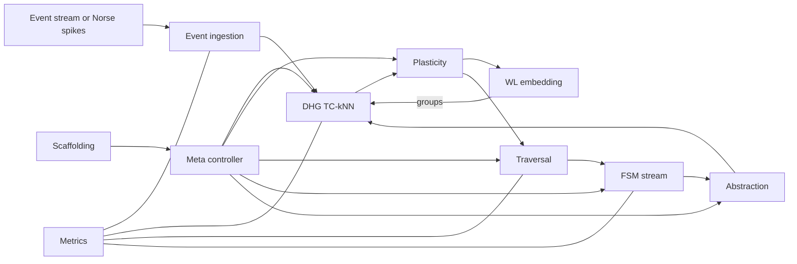

# Dynamic Causal Hypergraph DCH — Section 11 Software Prototype Blueprint Python Norse

Parent outline [DCH_TechSpec_Outline.md](../DCH_TechSpec_Outline.md)  
Cross references Section 1 [DCH_Section1_FormalFoundations.md](../sections/DCH_Section1_FormalFoundations.md), Section 2 [DCH_Section2_DHG_TCkNN.md](../sections/DCH_Section2_DHG_TCkNN.md), Section 3 [DCH_Section3_Plasticity.md](../sections/DCH_Section3_Plasticity.md), Section 4 [DCH_Section4_HyperpathEmbedding.md](../sections/DCH_Section4_HyperpathEmbedding.md), Section 5 [DCH_Section5_CreditAssignment.md](../sections/DCH_Section5_CreditAssignment.md), Section 6 [DCH_Section6_FSM.md](../sections/DCH_Section6_FSM.md), Section 7 [DCH_Section7_HierarchicalAbstraction.md](../sections/DCH_Section7_HierarchicalAbstraction.md), Section 8 [DCH_Section8_TaskAwareScaffolding.md](../sections/DCH_Section8_TaskAwareScaffolding.md), Section 9 [DCH_Section9_Interfaces.md](../sections/DCH_Section9_Interfaces.md), Section 10 [DCH_Section10_ComplexityResource.md](../sections/DCH_Section10_ComplexityResource.md)

Version v0.1

1. Goals and non goals
- Deliver a runnable Python reference implementation for event vision datasets DVS Gesture and N MNIST using Norse for SNN spiking and tonic for datasets.
- Prioritize streaming determinism, clear module boundaries, and observability over raw speed; enable later acceleration and hardware mapping.
- Non goals Training deep ANN baselines inside this repo; full distributed system; GPU optimized GNN training beyond a small GraphSAGE refresh.

2. Tech stack and dependencies
- Python 3.11, PyTorch 2.3+, Norse latest, tonic dataset loaders, numpy, numba optional, networkx for audits, dataclasses jsonschema for contracts, faiss optional for LSH, scikit learn optional for metrics, PyTorch Lightning or simple engine for loops, rich or loguru for logs.
- Optional GPU for periodic SAGE embedding; CPU path for WL and DHG.

3. Repository layout
- dch_core/
  - events.py event ingestion, watermarking, ring buffers
  - dhg.py TC kNN candidate gen, indices
  - plasticity.py watchers, EMA updates, pruning
  - embeddings/
    - wl.py WL online embedding, LSH grouping
    - sage.py periodic incidence GraphSAGE refresh
  - traversal.py backward B walk, beam control
  - fsm.py canonicalization, HH and CMS counting, hysteresis
  - abstraction.py higher order hyperedges creation and matching
  - scaffolding.py task similarity, freeze, regions, knobs
  - interfaces.py dataclasses for records and params, snapshot ids
  - meta.py meta controller policy and knob arbitration
  - metrics.py counters, gauges, tracing hooks
- experiments/
  - dvs_gesture.py end to end pipeline run config
  - n_mnist.py end to end pipeline run config
  - synthetic_micro.py seeded synthetic generators and assertions
- tests/ unit and integration tests per module
- configs/ default.yaml, dataset specific yaml
- docs/ this spec and diagrams

4. Data models implement contracts
- Implement records and params from [DCH_Section9_Interfaces.md](../sections/DCH_Section9_Interfaces.md) as python dataclasses and simple pydantic like validators if desired.
- Provide stable id functions for vertex id and edge id consistent with Section 9.

5. Event and SNN integration
- Use tonic to load DVS Gesture and N MNIST into event streams; or run a small Norse SNN to produce spikes from raw events.
- Event ingestion normalizes timestamps to microseconds, enforces per neuron monotonicity, and publishes events to DHG and WL update queues.

6. Pipeline orchestration and threading model
- Single process with cooperative components; three thread pools
  - Event lane DHG, Plasticity, WL update (tight latency path)
  - Reasoning lane Traversal, FSM, Abstraction (periodic)
  - Control lane Scaffolding, Meta controller (slow cadence)
- Use asyncio or concurrent futures; all modules expose non blocking APIs with bounded queues and watermark based flow control.

7. Scheduling and cadences
- Event lane processes events as they arrive with per event budgets from [DCH_Section10_ComplexityResource.md](../sections/DCH_Section10_ComplexityResource.md).
- Traversal cycles run every T trav default 20 ms or on demand when supervision arrives.
- SAGE refresh every 500 ms; FSM tick every 1 s or watermark driven; scaffolding policy step every 500 ms.

8. Module responsibility matrix
- DHG maps to Section 2; WL to Section 4; Plasticity to Section 3; Traversal to Section 5; FSM to Section 6; Abstraction to Section 7; Scaffolding to Section 8; Interfaces and Meta to Section 9.

9. Configuration system
- YAML config files under configs/ with env overrides.
- Hot reload of certain knobs via Meta controller step; immutable knobs require restart.

10. Minimal end to end loop pseudocode

```text
initialize_modules(config)
load_dataset_stream(dataset)

for batch in dataset.stream():
    for event in batch:  # event = (neuron_id, t_us)
        events.ingest(event)
        created_edges = dhg.on_post_spike(event)
        plasticity.on_event_tail_and_head(created_edges, event)
        wl.update_on_event(event)
        if wl.should_group(event):
            dhg.boost_with_groups(event, wl.propose_groups(event))

    if time_to_run_traversal():
        seeds = supervisor_or_reward.get_seeds()
        paths, edge_contribs = traversal.assign_credit(seeds, mode)
        plasticity.update_from_paths(edge_contribs)
        for p in paths:
            fsm.submit_path(p)

    if fsm.time_to_tick():
        promos, demos = fsm.tick()
        for rule in promos:
            abstraction.propose_from_rule(rule)
        meta.consume_fsm(promos, demos)

    if time_to_refresh_sage():
        sage.refresh()

    if scaffolding.time_to_step():
        knobs = scaffolding.policy_step(metrics.snapshot())
        meta.apply_knobs(knobs)
```

11. Norse SNN reference component
- Provide a small configurable Norse module that maps event frames to spikes for datasets that lack pre spiked streams.
- Keep SNN purely subsymbolic and do not backprop; rely on DCH learning loop for structure discovery.

12. WL embedding implementation notes
- Use stable 64 bit hashes and feature hashing to d 64; cosine LSH with faiss or custom bands/rows.
- Maintain per vertex vector table with last updated timestamp; enforce staleness bound 20 ms for DHG usage.

13. GraphSAGE periodic implementation
- Construct incidence expansion mini batches with neighbor sampling caps; run on GPU if available.
- Save snapshots with snapshot id and expose read only API to FSM.

14. FSM implementation notes
- Canonicalization pipeline per [DCH_Section6_FSM.md](../sections/DCH_Section6_FSM.md) with aggressively pooled buffers.
- SpaceSaving heavy hitters plus CMS; HLL for coverage; hysteresis to stabilize promotions.

15. Abstraction and traversal integration
- When rules promote, construct HOEs and insert; traversal consumes HOEs as compressed steps.
- Prevent double counting by marking compressed expansions in path records.

16. Scaffolding and meta control
- Compute activation overlap and WL centroid similarity; decide REUSE, ISOLATE, HYBRID; apply freeze and region policies.
- Meta controller arbitrates knobs across modules and enforces backpressure according to [DCH_Section10_ComplexityResource.md](../sections/DCH_Section10_ComplexityResource.md).

17. Metrics, logging, and tracing
- Counters for event rate, edges active, prune rate, traversal yield, rule promotions; latency histograms per lane.
- Structured logs with correlation id across modules; sample traces for hot paths.
- Support CSV Parquet export and simple dashboards via rich textual panels.

18. Testing strategy
- Unit tests per module for boundary cases and invariants
  - Temporal validity checks for DHG windows and refractory
  - Watcher creation and resolution determinism
  - WL collision precision on synthetic graphs
  - Traversal B connectivity and constraints
  - FSM canonicalization idempotency and hash stability
  - Abstraction cycle prevention and deduplication
- Integration tests
  - Synthetic micrographs with planted causal chains; ensure recall and precision targets per Section 5 and 6 acceptance criteria.
  - Dataset smoke tests run short streams and validate throughput and latency budgets from Section 10.

19. Example configs

```yaml
# configs/default.yaml
dataset: dvs_gesture
time:
  wl_cadence_ms: 10
  traversal_cadence_ms: 20
  sage_cadence_ms: 500
  fsm_tick_s: 1
windows:
  delta_min_us: 1000
  delta_max_us: 30000
  delta_causal_us: 2000
refractory_us: 1000
tc_knn:
  k_max: 3
  min_in: 6
  comb_cap: 10
plasticity:
  alpha: 0.1
  r_min: 0.02
  r_max: 0.98
wl:
  d: 64
  r: 2
  lsh:
    bands: 8
    rows_per_band: 4
traversal:
  seeds: 8
  depth: 12
  branch_cap: 4
  tau_select: 0.7
fsm:
  window_s: 60
  support_min: 50
  r_min: 0.6
  decay: 0.98
```

20. CLI entry points
- experiments/dvs_gesture.py runs the full pipeline with config path; flags for cadences and budgets.
- experiments/n_mnist.py same template for N MNIST.
- Support resume from snapshot ids for embeddings and rulesets.

21. Mermaid diagram overall software dataflow



22. Acceptance criteria for Section 11
- Clear repo structure with module responsibilities aligned to Sections 1 to 10.
- Deterministic streaming orchestration with lanes and cadences.
- Configs, metrics, and tests specified; example end to end loop given.
- Norse integration defined for dataset ingestion.
- Diagram provided reflecting dataflow and control.

23. Next steps
- Implement minimal skeletons and stubs for records and APIs from [DCH_Section9_Interfaces.md](../sections/DCH_Section9_Interfaces.md).
- Build synthetic micro benchmarks for Sections 5 and 6 validation.
- Prepare dataset adapters and smoke tests under experiments/.
- Iterate to performance targets in [DCH_Section10_ComplexityResource.md](../sections/DCH_Section10_ComplexityResource.md).

End of Section 11