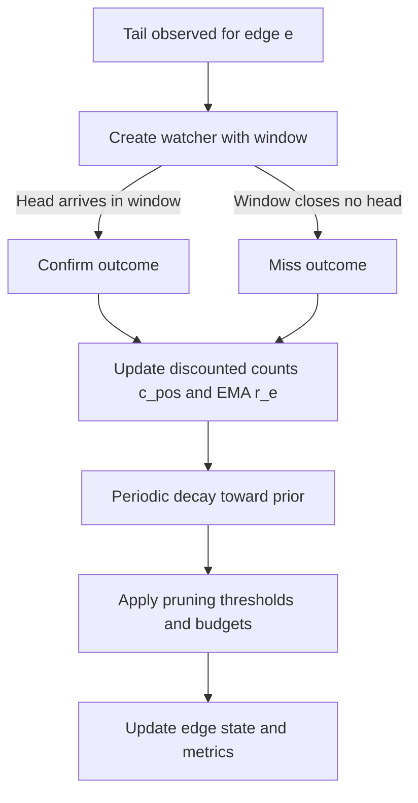

# Dynamic Causal Hypergraph DCH — Section 3 Hyperedge Plasticity Rules

Parent outline [DCH_TechSpec_Outline.md](../DCH_TechSpec_Outline.md)  
Cross references Section 1 [DCH_Section1_FormalFoundations.md](../sections/DCH_Section1_FormalFoundations.md) and Section 2 [DCH_Section2_DHG_TCkNN.md](../sections/DCH_Section2_DHG_TCkNN.md)

Version v0.1

1. Purpose and scope  
- Define local, event driven learning rules over hyperedges in E t.  
- Specify prediction logic, confirmation and miss detection, EMA reliability update, decay, and pruning.  
- Integrate with global credit assignment signals from Section 5 while remaining effective in purely unsupervised operation.

2. Plasticity primitives overview  
- Predict When a tail pattern of a hyperedge e appears, the system predicts that the head event should occur within the temporal window of e.  
- Confirm If the head event occurs within the specified window, treat as positive evidence.  
- Miss If the window elapses without the head, treat as negative evidence.  
- Decay Time based relaxation toward a prior to prevent stale edges from remaining overconfident.  
- Prune Remove edges with low, aging, or budget violating reliability to control combinatorics.  
- Freeze Gate updates for a subset of edges during task isolation per Section 8.

3. Event lifecycle objects  
3.1 Watcher records  
- For each edge e and each observed tail occurrence at time t start, instantiate a watcher w e,t with  
  - head window open equals t start plus Δ min and close equals t start plus Δ max  
  - status pending then confirmed or missed  
  - weight ω local for contribution to updates default 1.0  
  - provenance tail vertex ids and head neuron id  
- A watcher emits exactly one outcome confirmed or missed then becomes inactive.  
- Multiple watchers for the same edge may overlap if tails recur faster than window length.

3.2 Tail detection for watcher creation  
- A watcher is created when all elements of Tail e are observed with timestamps in nondecreasing order and within the small coherence band δ causal from Section 2, and before any head occurs.  
- If multiple spikes from the same presyn neuron arrive within δ causal, choose the latest for that occurrence or spawn multiple watchers under a combinations budget.

4. Reliability model and targets  
- Reliability r e is bounded r min less or equal r e less or equal r max with defaults 0.02 and 0.98.  
- Local target from watcher outcomes  
  - Let c pos e be the exponentially discounted count of confirmations for edge e.  
  - Let c neg e be the exponentially discounted count of misses for edge e.  
  - Local target r hat local e equals c pos e divided by c pos e plus c neg e plus ε where ε greater 0 is a stabilizer default 1.0.  
- Global target from credit assignment Section 5  
  - r hat path e derived from aggregated valid hyperpaths that used e.  
- Combined target  
  - r hat comb e equals λ path times r hat path e plus 1 minus λ path times r hat local e with λ path in 0 to 1 default 0.5.

5. Update rules  
5.1 EMA reliability update  
- Upon watcher resolution or credit assignment cycle update r e by  
  - r new e equals clip of 1 minus α times r old e plus α times r hat comb e with α default 0.1 and clip to bounds r min r max.  
- Increment usage count c e and set last update time.

5.2 Discounted counters update  
- Maintain discounted counts with decay factor γ c per event tick Δ t  
  - c pos e becomes γ c to the power Δ t times c pos e then plus sum over resolved watchers confirmed with weight ω local.  
  - c neg e becomes γ c to the power Δ t times c neg e then plus sum over resolved watchers missed with weight ω local.  
- Defaults γ c equals 0.98 per second equivalent when time is in seconds normalize Δ t by seconds.

5.3 Time decay toward prior  
- Between events or on periodic housekeeping, relax r e toward prior r 0 default midpoint 0.5 via  
  - r e becomes 1 minus β times r e plus β times r 0 with β small default 0.01 per second equivalent using elapsed wall time.  
- Skip decay when edge is frozen.

5.4 Confidence flooring and ceilings  
- Maintain invariant r min less or equal r e less or equal r max see Section 1.  
- Optionally shrink interval adaptively as edges age to avoid extremes under sparse evidence.

6. Confirmation and miss determination  
- For watcher w e,t with window open and close  
  - Confirm if a head spike for the exact head vertex neuron occurs with timestamp within open to close inclusive and is not vetoed by refractory ρ.  
  - Miss if the watermark passes window close and no valid head spike was observed.  
- Handle overlapping watchers by assigning a head spike to the earliest pending watcher first to avoid double counting, then to later ones if multiple heads occur.

7. Concurrency model and determinism  
- Process spikes in nondecreasing timestamp order with a per head neuron critical section to enforce refractory.  
- Watcher creation and resolution are idempotent under replays by using a deterministic watcher id composed of edge id, earliest tail timestamp, and head neuron id.  
- All updates to r e, counts, and usage are atomic; operations are commutative under batch replay.  
- Frozen edges are marked read only for reliability and counters.

8. Pruning policies  
8.1 Threshold based prune  
- Remove e if r e less than τ prune and age greater than τ age min or usage count below τ use min to avoid removing fresh edges prematurely.  
- Defaults τ prune 0.02, τ age min 2 seconds, τ use min 3.

8.2 Budget based prune  
- Maintain per head neuron budget K head for number of incoming edges; if exceeded, evict lowest priority edges by score s prune equals r e times freshness where freshness equals exp of negative lambda age times age.  
- Maintain global cap K global to bound memory footprint.

8.3 Inactivity prune  
- If no watcher has been created for e over horizon H idle remove e unless frozen or protected by provenance links due to abstraction.

8.4 Cascade integrity  
- When pruning an edge, detach any abstraction provenance links; if an abstraction becomes unsupported beneath a minimal support threshold, mark it for review or removal.

9. Freeze policy hooks  
- When task isolation is engaged Section 8 in the outline add e to protected set preventing reliability change and pruning.  
- Frozen edges may still accumulate read only statistics for monitoring.  
- Defrost by policy command with hysteresis to prevent thrashing.

10. Parameter table defaults  
- α 0.1 for EMA step size, r min 0.02, r max 0.98, r 0 0.5.  
- γ c 0.98 per second for discounted counts; β 0.01 per second for time decay.  
- τ prune 0.02, τ age min 2 s, τ use min 3, H idle 30 s.  
- Budgets K head 256 per head neuron default, K global configurable per platform.  
- λ path 0.5 to balance local and path based learning.

11. Observability and counters  
- per edge r e, c pos e, c neg e, last update time, age, frozen flag.  
- module rates watchers created per second, confirms per second, misses per second, prune events per second.  
- budget occupancy head budget usage histogram, global budget usage.  
- stability indicators fraction of edges near bounds, half life estimate median time to 10 percent change in r e.

12. Failure and edge cases  
- Head ambiguity multiple candidate heads within window close in time  
  - Prefer head matched via exact neuron id and strongest provenance chain if available else earliest in time.  
- Tail jitter if coherence fails by small margin epsilon jitter, allow a one time tolerance band configurable to increase recall at cost of precision.  
- Duplicate watcher creation deduplicated by watcher id.  
- Missing timestamps or out of order events buffer until watermark satisfies ordering assumptions.

13. Interaction with credit assignment Section 5  
- When a credit assignment cycle emits aggregated r hat path e, immediately perform an EMA update using r hat comb e as in Section 5.1 with λ path greater than 0.5 temporarily to capitalize on supervision, then anneal λ path back to default.  
- Alternatively treat path signals as additional weighted confirmations for matching watchers within the path window to unify accounting.

14. Mermaid diagram plasticity flow

15. Quality metrics and acceptance thresholds  
- Confirm rate divided by watchers created within 20 percent of estimated ground truth on synthetic microbenchmarks.  
- Prune precision at least 80 percent on synthetic tasks where true spurious edges are labeled.  
- Stability half life greater than or equal to 5 seconds at steady state under stationary streams with no supervision.  
- No drift beyond 5 percent in r e on frozen edges across test windows.

16. Interfaces aligned to module contracts  
- plasticity resolve watchers inputs time watermark returns resolved counts and list of edges updated.  
- plasticity update from path signals inputs mapping from edge id to r hat path weight returns applied updates.  
- plasticity prune step inputs current budgets and policy returns removed edges.  
- plasticity set freeze inputs set of edge ids and flag.  
- plasticity metrics snapshot returns structured counters.

17. Acceptance criteria for Section 3  
- Predict confirm miss mechanism with watcher abstraction is specified.  
- EMA reliability update, discounted counters, and time decay are defined with defaults and bounds.  
- Pruning policies threshold, budget, inactivity with cascade integrity are specified.  
- Concurrency, determinism, and freeze interactions are described.  
- Interfaces and observability align with the outline.

18. Cross references  
- Formal reliability bounds and attributes Section 1 see [DCH_Section1_FormalFoundations.md](../sections/DCH_Section1_FormalFoundations.md)  
- DHG candidate generation Section 2 see [DCH_Section2_DHG_TCkNN.md](../sections/DCH_Section2_DHG_TCkNN.md)  
- Credit assignment Section 5 outline see [DCH_TechSpec_Outline.md](../DCH_TechSpec_Outline.md)

End of Section 3