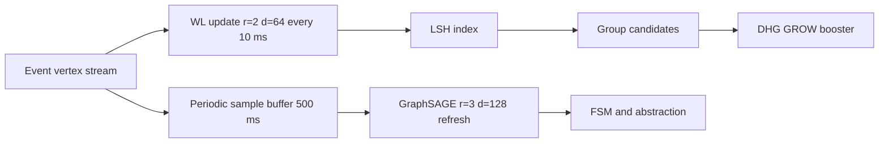

# Dynamic Causal Hypergraph DCH — Section 4 Hyperpath Embedding and Causal-Context Similarity

Parent outline [DCH_TechSpec_Outline.md](../DCH_TechSpec_Outline.md)  
Cross references Section 1 [DCH_Section1_FormalFoundations.md](../sections/DCH_Section1_FormalFoundations.md) and Section 2 [DCH_Section2_DHG_TCkNN.md](../sections/DCH_Section2_DHG_TCkNN.md)

Version v0.1

1. Purpose and scope
- Define causal-context embeddings used to group vertices by similarity of causal histories and to propose higher-order hyperedges.
- Specify an approved hybrid scheme
  - WL-style online embedding deterministic, r=2, d=64, update cadence 10 ms, drives streaming DHG grouping and GROW.
  - GraphSAGE incidence-expansion embedding periodic, r=3, d=128, refresh 500 ms, refines global causal-context for FSM and hierarchical abstraction.

2. Design overview and rationale
- The DCH operates on event tuples with sparse, evolving structure; vertex identity has little feature content.
- Similarity must reflect causal context i.e., hyperpaths terminating at vertices and the timing/reliability attributes along those paths.
- WL online delivers low-latency deterministic updates compatible with per-event GROW and PRUNE, while periodic SAGE captures richer higher-order context without stalling the stream.

3. Notation and prerequisites
- Vertex v equals i comma t see Section 1 [DCH_Section1_FormalFoundations.md](../sections/DCH_Section1_FormalFoundations.md).
- Hyperpath π and reliability r e defined in Section 1.
- TC kNN construction produces candidate edges around a head vertex see Section 2 [DCH_Section2_DHG_TCkNN.md](../sections/DCH_Section2_DHG_TCkNN.md).

4. WL-style online embedding WL
Defaults
- Radius r WL equals 2 backward hops over incident incoming hyperedges.
- Dimension d WL equals 64 via feature hashing.
- Update cadence Δt WL equals 10 ms wall-clock or watermark-aligned.
- Update policy deterministic incremental recompute affected vertices only.

4.1 Hypergraph neighborhood and labels
- Work on the directed hypergraph using backward incidence from head to tails.
- Node labels
  - For vertex v define base label l0 v as tuple neuron id i and time bucket of v timestamp quantized to q time equals 100 microseconds.
- Edge labels
  - For hyperedge e define label fe as tuple cardinality of Tail, delay stats mean and variance over Δ u equals head time minus tail times, and binned reliability r e bucketized into K r buckets.

4.2 WL iteration and hashing
- Iteration k equals 1 to r WL
  - For each vertex v collect multiset Mk v of labeled messages from parents
    - For each incoming e to v head compute message m e as hash fe concatenated with multiset of parent labels from previous iteration l k minus 1 of each u in Tail e and with temporal deltas Δ u bucketized.
  - Aggregate Mk v into string or tuple then hash with a stable 64 bit function.
- Feature hashing
  - Map each hashed token into d WL bins with k independent hash functions and add sign hashing for balanced updates.
  - Maintain an embedding vector x WL v in R to the d WL updated additively and normalized to unit norm.

4.3 Temporal features
- Bucketization
  - Δ u buckets logarithmic over 1 ms to 30 ms; refractory indicators as binary features.
- Recency
  - Apply exponential time decay weight w time equals exp of negative lambda time times Head time minus v time when aggregating labels default lambda time equals 1 divided by 200 ms.

4.4 Incremental maintenance
- Upon insertion of a new head vertex v post
  - Update l0 v post then perform up to r WL backward iterations confined to the r WL neighborhood frontier.
  - Only recompute x WL for vertices whose WL hash multiset changed.
- Complexity per event bounded by neighborhood growth; cap via frontier budget F max default 256 vertices.

4.5 Grouping with LSH
- Use cosine LSH over x WL to generate candidate groups of vertices with similar context.
- Parameters
  - Bands b equals 8, rows r band equals 4 per band, yielding 32 projections; collision threshold τ LSH equals 2 band matches.
- Output
  - For a new head v post return top K group candidates K group equals 3, each a small set of antecedent vertices whose embeddings collide with v post.

4.6 Integration with DHG GROW
- DHG candidate selection Section 2 augments TC kNN with WL grouping
  - For each group candidate G produce a higher-order tail by selecting the most recent event per neuron in G within δ causal; deduplicate against existing edges.
  - Prioritize these group-induced candidates by boosting s cand with a term proportional to average cosine similarity between x WL v post and group members.

5. GraphSAGE incidence-expansion embedding SAGE
Defaults
- Refresh cadence Δt SAGE equals 500 ms periodic batch run.
- Dimension d SAGE equals 128, radius r SAGE equals 3.
- Encoder
  - Operate on the bipartite incidence expansion H to B where H are hyperedge nodes and B are event vertices; connect v in B to e in H if v in Tail e or v equals Head e.
  - Use mean or attention aggregator with time encoding.

5.1 Features and encoders
- Vertex initial features
  - One hot neuron id compressed via trainable embedding table size N by d id where d id equals 16.
  - Time encoding via sinusoidal features over microsecond scale and recentness decay.
  - Local WL embedding x WL as input channel to SAGE to bootstrap structure.
- Hyperedge initial features
  - Tail size, reliability bucket, delay stats, age, and usage count.
- Aggregation
  - Layer l plus 1 embedding h v equals sigma of W l times concatenation of h v l and aggregate over neighbors N v h u l with time attention weights a u based on Δ and reliability.

5.2 Training objectives
- Unsupervised contrastive objective over positive pairs vertex and true hyperedge neighbors and negatives sampled by degree profile.
- Optional temporal skip gram objective over sequences of heads in short windows.

5.3 Outputs and usage
- Produce x SAGE v in R to the d SAGE for vertices and optionally x SAGE e for hyperedges.
- Publish a global causal-context map used by
  - Streaming FSM Section 6 to canonicalize and compress pattern types.
  - Hierarchical abstraction Section 7 to cluster similar hyperpaths before rule promotion.

5.4 Resource controls
- Mini-batch construction limited to B size equals 4096 vertices per refresh with neighbor sampling cap S nbr equals 32 and hyperedge sampling cap S edge equals 64.
- End-to-end refresh budget less than 20 ms on desktop target for 500 ms cadence.

6. Interfaces
6.1 WL online API
- embedding wl get vertex id returns vector x WL v
- embedding wl update on event vertex id timestamp returns updated vectors for touched vertices limited by F max
- embedding wl propose groups head vertex id returns list of K group candidate sets and similarity scores
- embedding wl params set or get to adjust r WL d WL Δt WL b r band τ LSH F max

6.2 GraphSAGE periodic API
- embedding sage refresh now returns snapshot id and statistics
- embedding sage get vertex id returns x SAGE v from latest snapshot
- embedding sage link FSM returns handles for FSM to use SAGE embeddings as features
- embedding sage params set or get to adjust r SAGE d SAGE Δt SAGE batch and sampling knobs

6.3 Unified embedding view
- embedding get vertex id returns x WL v and x SAGE v with timestamps and snapshot ids
- similarity vertex a vertex b mode in {WL, SAGE, HYBRID} returns cosine sims and composite score
- events to DHG pipeline requests WL-only fast path for GROW; FSM requests HYBRID targeting rule mining.

7. Parameter table defaults and tuning
- WL r WL 2, d WL 64, Δt WL 10 ms, frontier F max 256, LSH b 8, r band 4, τ LSH 2, lambda time 1 divided by 200 ms, q time 100 microseconds.
- SAGE r SAGE 3, d SAGE 128, Δt SAGE 500 ms, batch B size 4096, S nbr 32, S edge 64.
- Grouping K group 3, cosine threshold τ cos 0.65 for boosting DHG candidates.
- Tuning
  - Increase d WL to 128 if collision precision is low and budgets allow.
  - Reduce Δt WL if event density is low to amortize computations.

8. Complexity and performance
- WL per event
  - Neighborhood scan O frontier size up to F max; hashing O tokens with small constants; LSH insert O b.
  - Latency target less than 200 microseconds per event on desktop prototype.
- SAGE per refresh
  - Sampling O B size times S nbr plus S edge; message passing O edges in sampled subgraph; GPU offload recommended.

9. Data structures and storage
- Embedding tables
  - WL table map vertex id to x WL vector with last update time.
  - SAGE snapshot store map snapshot id to arrays for x SAGE.
- LSH indices
  - Maintain b hash tables with r band rows each keyed by integer projections; garbage-collect entries older than TTL equals 2 seconds.
- Provenance
  - Keep per-group creation records mapping from WL collisions to DHG candidates for auditability.

10. Quality metrics
- WL collision precision and recall measured against known causal groupings on synthetic workloads.
- Group-augmented DHG admission rate uplift relative to TC kNN only baseline.
- FSM rule discovery rate improvement when SAGE embeddings are available.
- End-to-end overhead percent of DHG latency budget consumed by WL updates; target less than 30 percent.

11. Failure and edge cases
- Hash collisions generating spurious groups mitigate by requiring minimum cosine τ cos and by deduplication against existing edges.
- Embedding staleness if WL cadence is too slow; enforce max staleness bound of 20 ms for DHG use.
- Snapshot skew between WL and SAGE when FSM consumes both; annotate paths with snapshot ids for reproducibility.

12. Security and privacy considerations
- Embedding vectors are derived from event timing and neuron ids; ensure logs redact raw timestamps when exporting outside the system by quantization per q time and by removing neuron id mapping tables.

13. Mermaid diagram embedding pipeline

14. Acceptance criteria for Section 4
- WL online embedding algorithm defined with temporal features, hashing, incremental maintenance, and LSH grouping.
- Integration with DHG candidate generation and prioritization specified.
- GraphSAGE periodic embedding defined with incidence-expansion modeling, features, objective, and refresh policy.
- Interfaces, defaults, complexity, and observability metrics provided.
- Diagram reflects dataflow and module boundaries.

15. Cross references
- Formal definitions Section 1 [DCH_Section1_FormalFoundations.md](../sections/DCH_Section1_FormalFoundations.md)
- DHG construction Section 2 [DCH_Section2_DHG_TCkNN.md](../sections/DCH_Section2_DHG_TCkNN.md)
- FSM Section 6 outline [DCH_TechSpec_Outline.md](../DCH_TechSpec_Outline.md)
- Abstraction Section 7 outline [DCH_TechSpec_Outline.md](../DCH_TechSpec_Outline.md)

End of Section 4