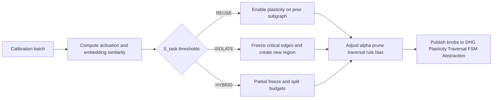

# Dynamic Causal Hypergraph DCH — Section 8 Task Aware Scaffolding Isolate or Reuse and Freeze

Parent outline [DCH_TechSpec_Outline.md](../DCH_TechSpec_Outline.md)  
Cross references Section 1 [DCH_Section1_FormalFoundations.md](../sections/DCH_Section1_FormalFoundations.md), Section 3 [DCH_Section3_Plasticity.md](../sections/DCH_Section3_Plasticity.md), Section 4 [DCH_Section4_HyperpathEmbedding.md](../sections/DCH_Section4_HyperpathEmbedding.md), Section 6 [DCH_Section6_FSM.md](../sections/DCH_Section6_FSM.md), Section 7 [DCH_Section7_HierarchicalAbstraction.md](../sections/DCH_Section7_HierarchicalAbstraction.md)

Version v0.1

1. Purpose and scope  
- Provide a continual learning control layer that detects task similarity and governs structural plasticity and protection to avoid catastrophic forgetting while enabling transfer.  
- Implement the FREEZE primitive and region based GROW biasing ISOLATE vs REUSE within the evolving DCH.  
- Define metrics, governance, and interfaces to coordinate with DHG, Plasticity, Traversal, FSM, and Abstraction modules.

2. Inputs and outputs  
Inputs  
- New task context with optional id and small calibration batch stream of events and labels.  
- Current DCH snapshot including reliability r e, usage counts, active HOEs, rule set from FSM, WL and optional SAGE embeddings.  
- Policy thresholds and budgets configurable at runtime.

Outputs  
- Freeze set P of protected edges and HOEs with immutability flags and pruning protection.  
- Region assignment map R mapping newly grown edges to a task specific region id with leakage control.  
- Updated per module knobs learning rate multipliers alpha, traversal biases, pruning thresholds, budgets.  
- Task registry entries with similarity scores, freeze schedules, and audit summaries.

3. Task similarity detection  
Goal Decide if the incoming task should reuse or isolate from prior knowledge.

3.1 Activation overlap signal  
- For calibration batch B task feed events through SNN and DCH to record activated high reliability structures.  
- Activated edge set A task equals { e mid r e greater or equal r act and edge participates in at least one valid path for batch } with r act default 0.7.  
- For each prior task u with protected set P u compute Jaccard J u equals size of intersection A task and P u divided by size of union A task and P u.

3.2 Embedding similarity signal  
- Compute WL embedding centroid c task over sink heads in calibration batch see [DCH_Section4_HyperpathEmbedding.md](../sections/DCH_Section4_HyperpathEmbedding.md).  
- For each prior task u with centroid c u compute cosine similarity S u cos equals cosine of c task and c u.

3.3 Performance signal optional  
- Evaluate quick proxy accuracy or reward on a small validation slice for candidate reuse vs isolate warm starts if available.

3.4 Unified similarity score  
- For each prior task u compute S u equals w act times J u plus w emb times S u cos plus w perf times normalized performance with defaults w act 0.5, w emb 0.4, w perf 0.1 when performance is available else renormalize.  
- Aggregate to S task equals max over u of S u best match prior task.  
- Decision thresholds reuse if S task greater or equal θ reuse default 0.6, isolate if S task less or equal θ isolate default 0.3, hybrid otherwise.

4. Policy actions  
4.1 REUSE mode S task greater or equal θ reuse  
- Keep plasticity enabled for structures relevant to the matched prior task  
  - Allow reliability updates for edges in P match and their neighborhoods.  
  - Temporarily raise plasticity α by factor k alpha up default 1.5 for matching subgraph and increase traversal softmax temperature mildly to explore variants τ select up factor 1.1.  
- Tighten pruning thresholds to preserve useful structures τ prune down factor 0.8 for matching subgraph.  
- Enable rule guided traversal priority weight w rule up to 0.8 for rules tagged to matched task.

4.2 ISOLATE mode S task less or equal θ isolate  
- Engage FREEZE for critical prior structures Section 5  
  - Freeze top K protect percent of edges and all active HOEs linked to matched tasks with high centrality and reliability.  
- Allocate a new region id r new and bias GROW to place new edges in this region only leakage below epsilon leak default 0.1  
  - For DHG candidate admission apply a penalty to candidates that connect across regions unless they pass a high reliability threshold from HOE priors.  
- Lower plasticity α for frozen regions to 0 and set pruning immunity for protected edges.  
- Increase budgets for new region K head up factor 1.2 and global cap fraction to accelerate learning without interfering with frozen structures.

4.3 HYBRID mode θ isolate less S task less θ reuse  
- Partially freeze A subset equals top quantile q freeze default 0.5 of critical edges based on composite score s crit equals r e times usage normalized times rule support.  
- Split budgets 50 50 across matched region and new region id and allow limited cross region linking with reliability gate r gate default 0.8.  
- Use traversal that prefers HOE compressions from prior task while permitting base edge exploration in new region.

5. FREEZE semantics and governance  
5.1 Freeze flags and effects  
- freeze reliability True prohibits updates to r e from watchers and path based signals see [DCH_Section3_Plasticity.md](../sections/DCH_Section3_Plasticity.md).  
- freeze prune True exempts edges from pruning policies except catastrophic integrity events.  
- freeze traversal protect True prevents negative evidence from erroneous seeds from depressing r e for protected edges.  
- All flags apply to both base edges and HOEs.

5.2 Critical set selection  
- Rank edges by s crit equals r e times usage rate times betweenness centrality estimate from recent traversal logs; include HOEs with rule support above r rule prior greater or equal 0.7.  
- Choose top K protect percent default 5 percent per matched task capped by K protect max default 50k.

5.3 Freeze schedule and review  
- Set freeze TTL default 120 s after which edges enter review state where small adaptation is allowed with α review default 0.02 and narrow bounds on r e delta per second.  
- Defrost requires two conditions satisfied stability of matched task performance over window W perf default 30 s and low cross task conflict rate measured as fraction of traversal depression events on protected edges less than τ conflict default 0.02.

5.4 Provenance and audit  
- Record freeze events with task id, reason, selection stats, and affected edge ids.  
- Provide reproducibility using snapshot ids for DCH and embedding models.

6. Regionization and structural isolation  
6.1 Region labeling  
- Assign region id attribute to edges on creation; inherit for HOEs from their constituent role neurons majority region.  
- region leakage epsilon leak allows a small fraction of cross region edges per head neuron to support transfer default 0.1.

6.2 GROW bias  
- In DHG admission Section 2 penalize candidates whose tails span multiple regions beyond leakage tolerance by subtracting penalty λ reg times span minus 1 with λ reg default 0.5 from s cand.  
- Prioritize within region candidates and HOE induced candidates matching the active task region.

6.3 Traversal guards  
- During credit assignment Section 5 restrict expansions that cross regions unless HOE or rule prior indicates relevance; annotate paths with region transitions for diagnostics.

7. Budgets and resource allocation  
- Maintain per region head budget K head region and global cap K global split across regions according to policy weights.  
- New region boosts K head region by up to 20 percent for warm up then anneal to steady share.  
- Enforce fairness by capping any single region at max share σ max default 0.6 of total active edges.

8. Interaction with rules and abstraction  
- Prioritize Active rules from FSM tagged to matched prior tasks in REUSE and HYBRID modes to bias traversal and DHG.  
- Frozen rules imply corresponding HOEs are protected; abstraction module may still collect usage metrics for them.  
- When a new task consistently triggers novel templates, promote rules and instantiate HOEs in the new region to accelerate learning see [DCH_Section6_FSM.md](../sections/DCH_Section6_FSM.md) and [DCH_Section7_HierarchicalAbstraction.md](../sections/DCH_Section7_HierarchicalAbstraction.md).

9. Parameters and defaults  
- Similarity thresholds θ reuse 0.6, θ isolate 0.3.  
- r act 0.7 for activation sets; weights w act 0.5, w emb 0.4, w perf 0.1.  
- Freeze K protect percent 5 percent, K protect max 50k, TTL 120 s, α review 0.02, τ conflict 0.02.  
- Region leakage epsilon leak 0.1, λ reg 0.5, σ max 0.6.  
- Budget multipliers k alpha up 1.5 for reuse, K head boost 1.2 for isolate warm up.  
- Reliability gates r gate 0.8 for cross region links.

10. Interfaces and data contracts  
scaffold start task  
- Inputs task id optional, calibration batch handle, policy overrides optional.  
- Returns decision mode in {REUSE, ISOLATE, HYBRID}, similarity score S task, freeze set summary, region id.

scaffold policy step  
- Inputs snapshot of recent metrics and drift indicators; returns incremental adjustments to α multipliers, τ prune, traversal weights, and budget shares.

scaffold set freeze  
- Inputs set of edge or HOE ids and flags; returns count applied and conflicts.

scaffold region map  
- Inputs mapping for new edges or neurons to region ids; returns acknowledgments.

scaffold metrics snapshot  
- Returns similarity history, protection population counts, region occupancy shares, transfer and forgetting metrics, and recent conflicts.

11. Metrics and evaluation  
- Forward transfer gain difference in sample efficiency or accuracy when reusing prior structures vs isolate baseline.  
- Backward transfer and forgetting measure change in prior task performance after learning new task under each policy.  
- Freeze precision fraction of protected edges that remain essential measured by traversal inclusion for matched tasks.  
- Region occupancy and leakage actual share vs policy targets and cross region edge rates.  
- Stability of r e on frozen edges should vary less than 5 percent across TTL windows.

12. Failure modes and mitigations  
- Over freezing underestimates similarity or too aggressive protection reduce K protect percent adaptively when forgetting is low and forward transfer is poor.  
- Under isolation reuse degrades prior tasks increase thresholds or strengthen penalties for cross region GROW.  
- Oscillation between modes apply hysteresis 0.05 to thresholds and minimum dwell time T dwell default 30 s before switching modes.  
- Imbalanced regions enforce σ max and rebalance budgets with gradual annealing.

13. Security and privacy  
- Task tags and freeze logs may reveal dataset identities restrict export by hashing task ids and summarizing metrics without raw ids.  
- Regions are internal control attributes do not expose in external logs unless anonymized.

14. Mermaid diagram task aware scaffolding

15. Acceptance criteria for Section 8  
- Similarity detection method defined with activation and embedding signals and unified score.  
- Policy actions specified for REUSE, ISOLATE, and HYBRID with parameter defaults.  
- FREEZE semantics and governance detailed, including selection, schedule, and audit.  
- Regionization defined with DHG and traversal integration and budget controls.  
- Interfaces, metrics, and a diagram provided.

16. Cross references  
- Reliability and pruning controls [DCH_Section3_Plasticity.md](../sections/DCH_Section3_Plasticity.md)  
- WL embeddings and grouping [DCH_Section4_HyperpathEmbedding.md](../sections/DCH_Section4_HyperpathEmbedding.md)  
- FSM rules and HOEs [DCH_Section6_FSM.md](../sections/DCH_Section6_FSM.md), [DCH_Section7_HierarchicalAbstraction.md](../sections/DCH_Section7_HierarchicalAbstraction.md)

End of Section 8