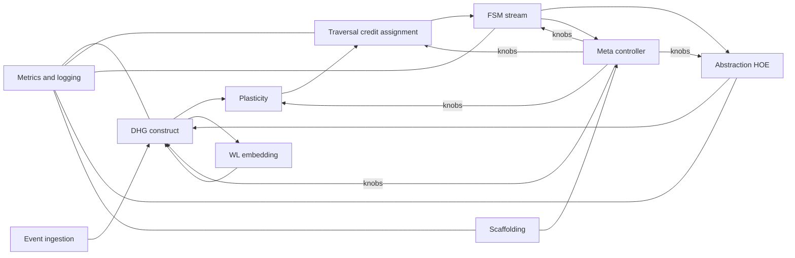

# Dynamic Causal Hypergraph DCH — Section 9 Module Interfaces and Data Contracts

Parent outline [DCH_TechSpec_Outline.md](../DCH_TechSpec_Outline.md)  
Cross references Section 1 [DCH_Section1_FormalFoundations.md](../sections/DCH_Section1_FormalFoundations.md), Section 2 [DCH_Section2_DHG_TCkNN.md](../sections/DCH_Section2_DHG_TCkNN.md), Section 3 [DCH_Section3_Plasticity.md](../sections/DCH_Section3_Plasticity.md), Section 4 [DCH_Section4_HyperpathEmbedding.md](../sections/DCH_Section4_HyperpathEmbedding.md), Section 5 [DCH_Section5_CreditAssignment.md](../sections/DCH_Section5_CreditAssignment.md), Section 6 [DCH_Section6_FSM.md](../sections/DCH_Section6_FSM.md), Section 7 [DCH_Section7_HierarchicalAbstraction.md](../sections/DCH_Section7_HierarchicalAbstraction.md), Section 8 [DCH_Section8_TaskAwareScaffolding.md](../sections/DCH_Section8_TaskAwareScaffolding.md)

Version v0.1

1. Purpose and scope  
- Define clear, stream safe interfaces among DCH subsystems useful for a Python prototype and for hardware co design alignment.  
- Specify data contracts for events, vertices, hyperedges, paths, templates, higher order hyperedges, and metrics.  
- Establish idempotency, ordering, and snapshot semantics.

2. Architectural interaction model  
- Event driven core with watermark based ordering.  
- Modules publish and consume records over in process queues or async calls.  
- Snapshot ids label embedding and rule tables to guarantee reproducibility.

3. Global identifiers and snapshots  
- neuron id integer stable per deployment.  
- vertex id 64 bit generated as hash of neuron id and timestamp microseconds.  
- hyperedge id 128 bit generated from tail signature and head vertex id.  
- hoe id 128 bit generated from template id and version.  
- snapshot id string for WL and SAGE embedding refresh cycles and FSM ruleset revisions.  
- traversal cycle id string per credit assignment pass.

4. Data contracts core records  
4.1 Event record  
- neuron id  
- timestamp microseconds  
- meta optional map includes source sensor id and split tags

4.2 Vertex record  
- vertex id  
- neuron id  
- timestamp microseconds

4.3 Hyperedge record event anchored  
- edge id  
- tail list of vertex ids  
- head vertex id  
- delta min microseconds  
- delta max microseconds  
- refractory microseconds  
- reliability float bounded  
- created at microseconds  
- last update time microseconds  
- usage count integer  
- type equals event edge

4.4 Hyperedge record template or HOE  
- edge id  
- tail roles list each role contains neuron id and lag interval bins  
- head role neuron id  
- delta min ho microseconds  
- delta max ho microseconds  
- refractory microseconds  
- reliability float bounded  
- created at microseconds  
- last update time microseconds  
- usage count integer  
- type equals template edge  
- version integer  
- provenance list template ids and exemplar references

4.5 Path record from traversal  
- seed vertex id  
- path edge ids ordered  
- score float product of reliabilities  
- mode reward or error or correct  
- snapshot ids for embeddings and rules  
- cycle id  
- audit optional list of vertex ids for debug

4.6 Template record from FSM  
- template id  
- canonical string audit safe  
- support windowed integer or float  
- reliability average float  
- coverage distinct sinks estimate  
- status active or inactive  
- params bins lags and buckets  
- snapshot id

5. Module interface contracts  
5.1 Event ingestion  
- push event input event record returns accepted boolean and queue depth  
- get watermark returns current logical time and lag statistics

5.2 Dynamic hypergraph construction DHG  
- on post spike input neuron id and timestamp returns created edge ids list and counts of candidates evaluated and deduplicated  
- get edges by head input head vertex id returns list of hyperedge records  
- get edges by tail key input tail signature returns hyperedge record if present  
- set params input map of window and budget parameters returns applied config

5.3 Plasticity  
- resolve watchers input watermark time returns resolved outcome counts and updated edge ids list  
- update from paths input map edge id to r hat path returns applied updates count  
- prune step input policy id returns removed edge ids list  
- set freeze input ids and flags returns applied counts

5.4 Embedding WL online  
- update on event input vertex id and timestamp returns list of touched vertex ids  
- propose groups input head vertex id returns list of group candidates and similarity scores  
- get vertex embedding input vertex id returns vector and last update time  
- set params input r wl and d wl and lsh knobs returns applied config

5.5 Embedding SAGE periodic  
- refresh now input snapshot hint returns snapshot id and stats  
- get vertex embedding input vertex id and snapshot id returns vector  
- link fsm input enable flag returns acknowledgment

5.6 Traversal credit assignment  
- assign credit input seeds and mode and caps returns path records and edge contribution map  
- get metrics snapshot returns traversal counters and latency stats  
- set params input M and L and B and tau select and H back returns applied config

5.7 FSM streaming frequent hyperpath mining  
- submit path input path record returns template id and counting tier heavy hitter or cms  
- tick input watermark time returns maintenance stats and promotions and demotions since last tick  
- poll promotions input limit returns up to limit rule descriptors  
- get template stats input template id returns statistics  
- set params input window sizes and thresholds returns applied config

5.8 Abstraction hierarchical  
- propose from rule input rule descriptor returns hoe id and dedup result  
- match and instantiate input head vertex id and recent sources returns matched hoe instances  
- compress for traversal input frontier state returns admissible hoe expansions with scores  
- get metrics snapshot returns abstraction usage rates and path shortening  
- set params input budgets and merge thresholds returns applied config

5.9 Scaffolding task aware  
- start task input task id and calibration handle returns decision mode and similarity score and region id  
- policy step input recent metrics returns knob adjustments for modules  
- set freeze input ids and flags returns applied counts  
- region map input edge to region assignments returns acknowledgments  
- get metrics snapshot returns protection population and region occupancy

5.10 Meta controller  
- step input module summaries returns global actions for thresholds budgets and traversal bias  
- subscribe metrics input list of modules returns composite dashboard feed id  
- get policy state returns current objectives weights and recent actions

5.11 Logging and metrics  
- emit counter input name and value with tags returns acknowledgment  
- emit gauge input name and value with tags returns acknowledgment  
- emit event input name and payload returns acknowledgment  
- list metrics returns available series and tag keys

6. Ordering idempotency and error handling  
- Ordering watermark based with per neuron monotonic timestamps and per head critical sections.  
- Idempotency keys  
  - DHG creation token tuple head vertex id and tail signature  
  - Watcher id tuple edge id and earliest tail timestamp and head neuron id  
  - FSM canonical hash template id and collision verification with canonical string when necessary  
- Retries and dedup based on these keys.  
- Error classes  
  - input out of order within tolerance buffer exceeded  
  - budget exceeded candidate dropped  
  - stale snapshot embedding requested  
  - freeze conflict update denied

7. Security privacy and governance  
- Redact neuron id mapping for external logs through a one way dictionary.  
- Quantize timestamps to q time for export.  
- Access control roles viewer and operator and admin for freeze and policy changes.  
- Provenance retention policy with TTL and hashed exemplar ids.

8. Observability and health  
- Per module metrics common core  
  - qps and latency buckets  
  - queue depth and watermark lag  
  - error rates per class  
  - budget occupancy and drops  
- Tracing  
  - attach correlation id across event to edge creation to traversal to FSM to abstraction  
  - sample traces for heavy code paths and anomaly triggers

9. Mermaid diagram module interaction

10. Acceptance criteria for Section 9  
- Interfaces for all modules defined with inputs and outputs and configuration hooks.  
- Data contracts specified for core records and identifiers and snapshots.  
- Ordering and idempotency semantics established for safe streaming.  
- Security and observability guidelines included.  
- Diagram reflects module interactions and control flow.

11. Cross references  
- Temporal validity and hyperedge schema Section 1 [DCH_Section1_FormalFoundations.md](../sections/DCH_Section1_FormalFoundations.md)  
- DHG operations Section 2 [DCH_Section2_DHG_TCkNN.md](../sections/DCH_Section2_DHG_TCkNN.md)  
- Plasticity update and pruning Section 3 [DCH_Section3_Plasticity.md](../sections/DCH_Section3_Plasticity.md)  
- Embeddings Section 4 [DCH_Section4_HyperpathEmbedding.md](../sections/DCH_Section4_HyperpathEmbedding.md)  
- Traversal Section 5 [DCH_Section5_CreditAssignment.md](../sections/DCH_Section5_CreditAssignment.md)  
- FSM Section 6 [DCH_Section6_FSM.md](../sections/DCH_Section6_FSM.md)  
- Abstraction Section 7 [DCH_Section7_HierarchicalAbstraction.md](../sections/DCH_Section7_HierarchicalAbstraction.md)  
- Scaffolding Section 8 [DCH_Section8_TaskAwareScaffolding.md](../sections/DCH_Section8_TaskAwareScaffolding.md)

End of Section 9